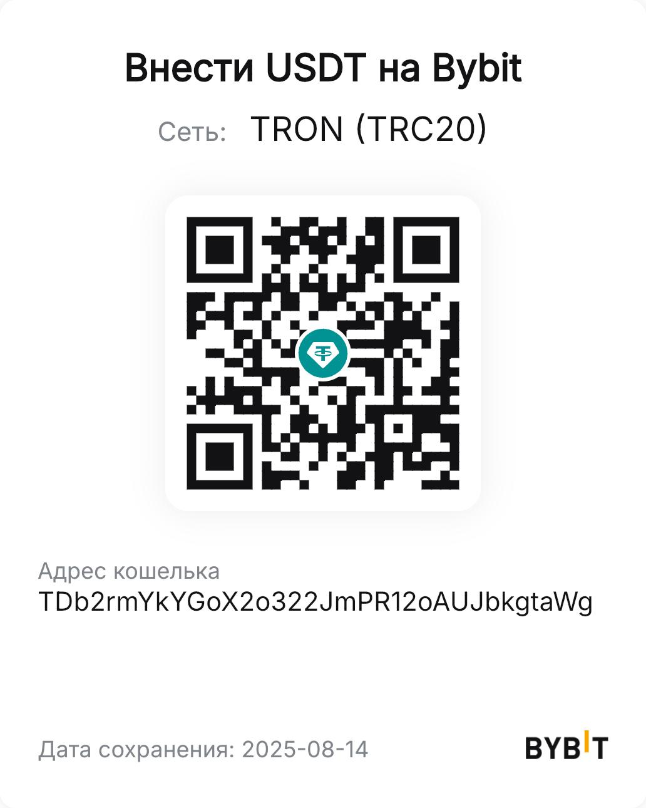

# 🐳 Seafile: локальная установка за 1 минуту (Docker + HTTPS)

Этот репозиторий поднимает **Seafile** в локальной сети в Docker, с HTTPS (самоподписанный сертификат) и готов к автосинхронизации на ноутбуке и телефоне через официальные клиенты Seafile.

## 🚀 Быстрый старт
```bash
git clone https://github.com/USERNAME/seafile-local-install.git
cd seafile-local-install
cp .env.example .env
nano .env   # впишите свои значения (LOCAL_IP, EMAIL, пароли)
chmod +x install.sh
./install.sh
```

После запуска откройте:
```
https://<SEAFILE_SERVER_HOSTNAME>:<HTTPS_PORT>
```
Логин и пароль администратора — те, что вы указали в `.env`.

## 🧩 Что разворачивается
- `mariadb` — база данных
- `redis` — кэш
- `seafile` — сервер Seafile
- `nginx` — HTTPS-прокси на порту `${HTTPS_PORT}` (по умолчанию 8443)

## 📱 Клиенты
- **Ноутбук/ПК:** установите Seafile Client, добавьте новый аккаунт с адресом `https://<IP>:8443` и логином/паролем.
- **Телефон:** установите Seafile для Android/iOS, укажите тот же адрес `https://<IP>:8443`. В настройках можно включить автозагрузку фото по Wi‑Fi.

## 🔒 Сертификат
Скрипт сам создаст самоподписанный сертификат с SAN, где будет указан ваш `LOCAL_IP`. На первом подключении браузер/клиент могут попросить подтвердить исключение — это нормально для локального сертификата.

## 📂 Данные
- База: `./data/db`
- Данные Seafile и конфиги: `./seafile`
- Сертификаты: `./certs`

## 🛠️ Полезные команды
```bash
docker compose ps
docker compose logs -f
docker compose restart seafile nginx
docker compose down
```

## 💖 Поддержать разработчика
Если репозиторий был полезен:

Адрес (USDT TRC20): `TDb2rmYkYGoX2o322JmPR12oAUJbkgtaWg`


